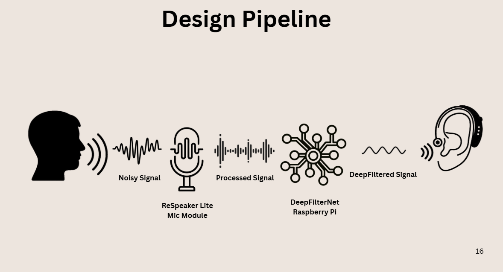
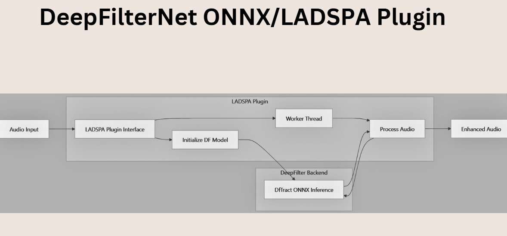
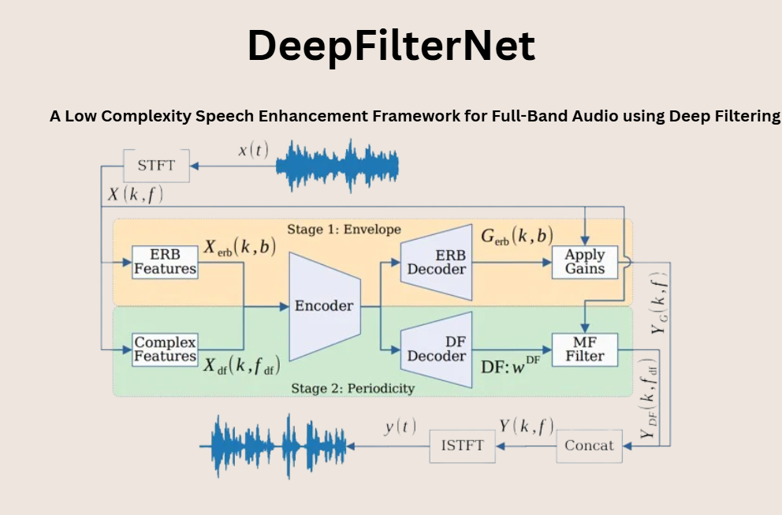
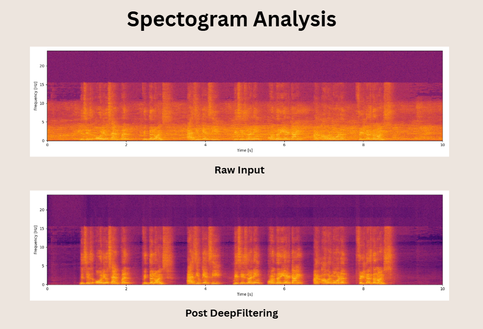
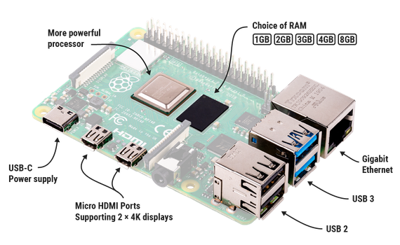
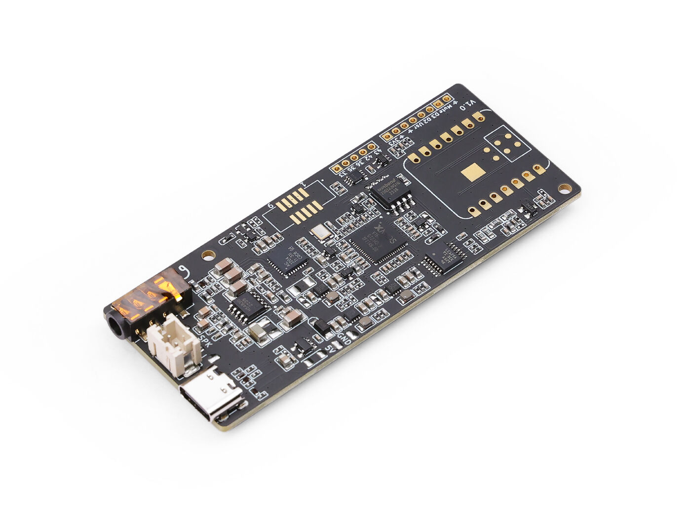

# CLARITY
### Low-Latency Edge-AI Speech Enhancement System for Hearing Accessibility

> Low-Latency Edge-AI Speech Enhancement for Hearing Accessibility and Real-Time Audio Interfaces


[](#)

---



---
## Team

CLARITY was developed as part of the EMPOWER Student Design Challenge and Assistive Technologies Initiative.

| Name               | Role                                                   | GitHub                                   |
| ------------------ | -------------------------------------------------      | ---------------------------------------- |
| Pushkar Chaturvedy | Project Lead, Systems Design, Edge-AI Integration      | [@USERNAME](https://github.com/QCodeR-Innovate) |
| Munukutla Vamsi    | Hardware & Embedded Systems                            | [@USERNAME](https://github.com/Thinkcrafty) |
| Shreerang Joshi    | Research & Validation, DFN Fine Tuning and Optimisation| [@USERNAME](https://github.com/ThePurpleCode) |
| Dhruv Kumar        | Product Design & Documentation                         | [@USERNAME](https://github.com/dhruvnarayan311-dot) |

---

## Abstract

Traditional Frequency Modulation (FM) assistive audio systems can significantly improve speech intelligibility for students with hearing impairments, but they often rely on proprietary protocols and expensive closed hardware. **CLARITY** is an open-source alternative built to make low-latency classroom audio enhancement more accessible.

The system combines a **Seeedstudio ReSpeaker Lite** front-end (with XMOS-based hardware DSP) and a **Raspberry Pi 4 Model B** running a native **DeepFilterNet3** inference pipeline. A custom **LADSPA** plugin wraps **ONNX Runtime** so the model can run in a real-time Linux audio path with asynchronous worker-thread execution and ring-buffer-based audio transfer. The result is a practical prototype for assistive listening, speech separation, conferencing, and other low-power edge audio applications.

---

## Project Resources

In addition to the technical documentation provided within this repository, supplementary project materials are available below.

### Presentation & Demonstration

The complete project presentation includes:

* System architecture visualizations
* Engineering design rationale
* Experimental validation
* Spectrogram analysis
* Embedded audio comparisons and demonstrations

📊 **Presentation:** [View Canva Presentation](https://canva.link/tkrq5c3djb3mhbd)

> The presentation contains audio samples and comparative demonstrations that cannot be embedded directly within GitHub documentation.


---

## Why this project exists

CLARITY was designed for environments where speech clarity matters but commercial assistive audio hardware is not affordable or flexible enough. The goal was not just to build a demo — it was to build a system that could be understood, reproduced, modified, and extended from scratch.

This repository is structured so that the README itself acts as:

- a research-paper style technical overview,
- a build-and-replicate guide,
- a user manual,
- and an onboarding document for contributors.

---

## Documentation

The CLARITY repository is organized into focused technical documents that cover different aspects of the system.

| Document | Description |
|-----------|-------------|
| [Hardware Platform](docs/HARDWARE_PLATFORM.md) | Hardware architecture, component selection, and engineering rationale |
| [Product Design](docs/PRODUCT_DESIGN.md) | User-centric design philosophy, beamforming strategy, wearability, and deployment model |
| [Future Directions](docs/FUTURE_DIRECTIONS.md) | Research extensions, optimization opportunities, and future applications |
|

---

## At a glance

| Item | Details |
|---|---|
| Project name | CLARITY |
| Core use case | Classroom hearing accessibility |
| Secondary use cases | Video conferencing, voice enhancement, low-latency audio tools |
| Front-end hardware | Seeedstudio ReSpeaker Lite |
| Compute node | Raspberry Pi 4 Model B |
| Core model | DeepFilterNet3 |
| Runtime format | ONNX |
| Audio plugin layer | LADSPA |
| Audio subsystem | ALSA |
| Design goal | Low-cost, low-latency, open-source speech enhancement |

---

## Key features

- **Two-stage audio pipeline** split between hardware pre-processing and edge compute.
- **Real-time Linux audio integration** using LADSPA and ALSA.
- **Asynchronous inference thread** to keep the audio callback responsive.
- **Edge-friendly speech enhancement** using DeepFilterNet3.
- **Modular architecture** that can be adapted for assistive devices, conferencing, and wearable audio systems.
- **Open repository layout** intended for long-term maintenance and reproducibility.

---

## Future Directions

CLARITY was developed as a proof-of-concept edge-AI speech enhancement platform for hearing accessibility. While the current implementation demonstrates the feasibility of low-cost, low-latency speech enhancement, several opportunities exist for extending the research and expanding the product ecosystem.

Potential future directions include:

* Domain-specific model retraining for classroom environments
* Quantization and model compression for wearable deployment
* Extended beamforming through larger microphone arrays
* Real-time speaker tracking and localization
* Bluetooth Low Energy and wireless hearing-aid integration
* Multi-speaker separation and conversational awareness
* Edge-AI communication devices and conferencing systems
* Assistive technologies beyond hearing accessibility

For a detailed roadmap and research discussion, see:

📖 **[Future Directions](docs/FUTURE_DIRECTIONS.md)**


---

## Visual overview

### 1) System concept and end-to-end topology


### 2) LADSPA / ONNX pipeline and worker-thread routing



### 3) DeepFilterNet3 architecture under the hood



### 4) Validation spectrograms: raw input vs deep-filtered output



> **Note:** These figures are expected to live inside the `assets/` folder exactly as named above.

---

## System architecture

CLARITY is intentionally split into two layers:

1. **Hardware pre-processing layer**  
   The ReSpeaker Lite handles front-end capture, beamforming, and noise suppression.

2. **Edge-AI enhancement layer**  
   The Raspberry Pi 4 runs the DeepFilterNet3 model through an ONNX-based LADSPA plugin.

This division keeps the real-time audio path deterministic while allowing the neural inference workload to run asynchronously.

### Architecture summary

```text
Acoustic environment
        │
        ▼
Seeedstudio ReSpeaker Lite
(hardware DSP / mic array)
        │
        ▼
Raspberry Pi 4
(LADSPA audio callback + ONNX worker thread)
        │
        ▼
Enhanced speech output
```

ReSpeaker Lite
      │
      ▼
 Hardware DSP
(AEC + AGC + Beamforming)
      │
      ▼
 Raspberry Pi 4
      │
      ▼
 LADSPA Plugin
      │
      ▼
 ONNX Runtime
      │
      ▼
 DeepFilterNet3
      │
      ▼
 Enhanced Speech

---

## Hardware and software stack

| Layer | Component | Role |
|---|---|---|
| Input hardware | Seeedstudio ReSpeaker Lite | Microphone array, beamforming, hardware noise suppression |
| Edge compute | Raspberry Pi 4 Model B | Runs the low-latency inference pipeline |
| ML model | DeepFilterNet3 | Speech enhancement / deep filtering |
| Runtime | ONNX Runtime | Executes the model efficiently on-device |
| Audio plugin | LADSPA | Integrates processing into Linux audio flow |
| Audio backend | ALSA | Provides low-level real-time audio access |
| Build tooling | C / Rust / Python toolchain | Native plugin and runtime support |

---

## Hardware Platform

CLARITY leverages a two-stage edge-computing architecture consisting of a dedicated audio front-end DSP and an embedded AI inference engine.

| Component | Purpose |
|------------|----------|
| Raspberry Pi 4 Model B | Edge AI inference and runtime orchestration |
| ReSpeaker Lite (XMOS XU316) | Beamforming, AEC, AGC, and noise suppression |
| DeepFilterNet3 | Neural speech enhancement |
| ONNX Runtime | Efficient model inference |
| LADSPA | Low-latency Linux audio integration |

---

## Repository structure

```text
CLARITY/
├── hardware/
│   ├── CAD/
│   ├── STL/
│   └── assembly-notes/
├── software/
│   ├── ladspa-plugin/
│   ├── onnx-runtime/
│   ├── model/
│   └── scripts/
├── assets/
│   ├── design_pipeline.png
│   ├── onnx_ladspa_plugin.png
│   ├── dfn_architecture.png
│   └── spectrogram_analysis.png
├── documents/
│   ├── paper/
│   ├── slides/
│   └── reports/
└── README.md
```

## How it works

### Stage 1: hardware DSP pre-processing

The ReSpeaker Lite captures audio through a dual-MEMS microphone array. Its onboard XMOS processor handles early-stage processing such as:

- beamforming,
- acoustic echo cancellation,
- automatic gain control,
- and noise suppression.

This reduces the burden on the Raspberry Pi and helps preserve speech structure before neural enhancement begins.

### Stage 2: DeepFilterNet3 enhancement

The edge compute node receives the cleaner signal and applies DeepFilterNet3. The model operates in the frequency domain using a perceptually meaningful representation, which makes it efficient enough for embedded deployment.

The overall flow is:

```text
Noisy input
  → STFT
  → spectral features / ERB envelope
  → deep filtering / periodicity refinement
  → ISTFT
  → cleaned speech
```

### Real-time threading model

The LADSPA plugin is designed around a split-thread architecture:

- **Audio callback thread:** strict real-time audio handling
- **Worker thread:** ONNX inference and frame processing

A ring-buffer arrangement decouples real-time input/output from model compute so the audio callback does not block.

---

## Performance goals

| Metric | Target / Observation |
|---|---|
| End-to-end latency | Sub-200 ms target |
| Model window latency | ~40 ms model boundary |
| Runtime mode | Real-time streaming |
| Edge deployment | Raspberry Pi class hardware |
| Design priority | Preserve intelligibility without muting ambient context |

---

## Bill of materials

| Component | Specification | Approx. cost (INR) |
|---|---|---:|
| Raspberry Pi 4 Model B | Quad-core ARM Cortex-A72, 4 GB RAM | 5,800 |
| Seeedstudio ReSpeaker Lite | XMOS XU316, 2-mic array | 2,560 |
| MicroSD card | 16 GB Class 10 | 500 |
| Wired earphones | Low-impedance 3.5 mm monitoring | 600 |
| Power supply | 5V 3A USB-C adapter | 500 |
| **Total** |  | **~9,960** |

---

### Hardware Overview

<table>
<tr>
<td align="center">
<br>
<b>Raspberry Pi 4 Model B</b>
</td>

<td align="center">
<br>
<b>ReSpeaker Lite (XMOS XU316)</b>
</td>
</tr>
</table>

For detailed hardware specifications and engineering rationale, see:

📖 **[Hardware Documentation](docs/HARDWARE.md)**

---

## DeepFilterNet

CLARITY builds upon the excellent DeepFilterNet framework developed by the original authors.

Original Repository:

🔗 https://github.com/rikorose/deepfilternet

DeepFilterNet provides the low-complexity full-band speech enhancement architecture that serves as the core neural speech separation engine used in this project.

Please consider starring and citing the original repository if this project proves useful.

---

## Prerequisites

Before building, make sure you have:

- Raspberry Pi OS Lite (64-bit) or another lightweight Linux environment
- ALSA access
- build-essential / cmake / clang toolchain
- Rust toolchain
- Python with package installation access
- a working ReSpeaker Lite connection
- a DeepFilterNet3 model export compatible with ONNX Runtime

---

## Quick start

### 1) Prepare the system

Use a clean Raspberry Pi OS Lite installation to avoid unnecessary desktop overhead.

### 2) Configure ALSA

A minimal ALSA configuration can route the default audio device directly to hardware:

```conf
pcm.!default {
    type hw
    card 1
}

ctl.!default {
    type hw
    card 1
}
```

> Adjust `card 1` to match your connected ReSpeaker Lite device.

### 3) Install dependencies

```bash
sudo apt-get update && sudo apt-get install -y \
    build-essential \
    cmake \
    ladspa-sdk \
    libasound2-dev \
    llvm-dev \
    clang

curl --proto '=https' --tlsv1.2 -sSf https://sh.rustup.rs | sh
source "$HOME/.cargo/env"

pip install maturin poetry
```

### 4) Build the LADSPA module

```bash
git clone https://github.com/rikorose/deepfilternet.git
cd deepfilternet
cd ladspa
cargo build --release
sudo cp target/release/libasound_module_ladspa_df.so /usr/lib/ladspa/
```

### 5) Run inference

```bash
export DEEPFILTERNET_MODEL="models/DeepFilterNet3"
deep-filter --compensate-delay --pf audio_input_stream.wav -o output/
```

---

## Full replication guide

### Step 1: flash the operating system

Install Raspberry Pi OS Lite (64-bit) to the MicroSD card.

### Step 2: connect the input hardware

Attach the ReSpeaker Lite and verify that the device is visible to ALSA.

### Step 3: confirm low-latency audio routing

Ensure that no unnecessary higher-level audio services are interfering with the stream.

### Step 4: build the native module

Compile the LADSPA plugin and copy the resulting shared library into the LADSPA path.

### Step 5: validate with known audio samples

Use controlled recordings first, then live classroom audio, then long-duration stress tests.

---

## Validation and testing

The best visual proof of the system is the spectrogram comparison between raw audio and enhanced audio.

### What to look for

- broadband background noise should be reduced,
- speech harmonics should stay visible,
- formant structure should remain intact,
- the output should sound clearer without becoming unnaturally gated.

### Spectrogram reference


---

## Design notes

### Why LADSPA

LADSPA makes it possible to integrate signal processing into Linux audio pipelines with a small and focused plugin layer.

### Why ONNX

ONNX gives a portable way to run the model without tying the project to one training framework.

### Why DeepFilterNet3

DeepFilterNet3 provides a strong quality-to-efficiency balance for embedded speech enhancement.

### Why asynchronous inference

Real-time audio systems cannot afford callback stalls. Separating the compute thread from the callback thread keeps the stream stable.

---

## Known limitations

- Performance depends on the exact Raspberry Pi model and system load.
- Latency can vary if ALSA is not configured cleanly.
- Model quality may change across different acoustic environments.
- Wearable deployment will require stronger power optimization than the current prototype.

---

## Roadmap

| Next step | Goal |
|---|---|
| Quantization-aware training | Reduce model size and improve throughput |
| Structured pruning | Lower compute cost on edge devices |
| Domain adaptation | Improve performance in Indian classroom acoustics |
| Buffer tuning | Reduce jitter and improve determinism |
| Power optimization | Move toward battery-friendly deployment |
| Wearable form factor | Explore ultra-low-power alternatives to Raspberry Pi-class compute |

---

## Applications beyond classrooms

Although the project began as an assistive classroom system, the same architecture can support:

- meeting-room voice enhancement,
- conferencing microphones,
- edge audio assistants,
- wearable speech clarification,
- and other low-latency speech separation tools.

---

## Contributing

Contributions are welcome. Useful areas include:

- audio pipeline improvements,
- real-time performance tuning,
- model compression,
- hardware casing and integration,
- documentation,
- and benchmark reporting.

### Suggested contribution workflow

1. Fork the repository.
2. Create a feature branch.
3. Make your changes.
4. Test with real audio where possible.
5. Submit a pull request with a clear explanation of the change.

---

## Acknowledgements

This project builds on ideas and tooling from the broader open-source audio and machine learning ecosystem, including:

- **DeepFilterNet**
- **LADSPA**
- **ONNX Runtime**
- **ALSA**
- **Raspberry Pi**
- **Seeedstudio ReSpeaker Lite**

### DeepFilterNet

Speech enhancement framework:

https://github.com/rikorose/deepfilternet

### Raspberry Pi Foundation

Embedded computing platform:

https://www.raspberrypi.com/products/raspberry-pi-4-model-b/

### Seeed Studio

ReSpeaker Lite microphone array:

https://www.seeedstudio.com/ReSpeaker-Lite-p-5928.html

### ONNX Runtime

Cross-platform machine learning inference engine:

https://onnxruntime.ai/

## Authors

* Pushkar Chaturvedy
* Munukutla Vamsi
* Shreerang Joshi
* Dhruv Kumar

For questions, suggestions, or collaboration opportunities, please reach out through GitHub Issues or contact the contributors listed above.


---

## Contributing

Contributions, bug reports, feature requests, and documentation improvements are welcome.

Please open an issue before submitting significant architectural changes to ensure alignment with the project's roadmap.

---

## License

This project is released under the **MIT License**.

The MIT License permits unrestricted use, modification, distribution, and commercial adoption of this work, provided that the original copyright notice and license text are included in all copies or substantial portions of the software.

For full license details, see the [`LICENSE`](LICENSE) file in the repository.

© 2026 Pushkar Chaturvedy and Contributors.


---

## Contact / project notes

This README is written to serve as the public-facing technical entry point for the CLARITY repository. It is structured so that a new contributor can understand the idea, inspect the architecture, and reproduce the build with minimal context.

---

## Suggested next files

- `hardware/assembly-notes.md`
- `software/build.md`
- `software/runtime.md`
- `documents/benchmark-report.md`
- `documents/architecture-notes.md`

---

## Figure placeholders recap

| Figure | File path |
|---|---|
| System concept / topology | `assets/design_pipeline.png` |
| LADSPA / ONNX threading pipeline | `assets/onnx_ladspa_plugin.png` |
| DeepFilterNet3 architecture | `assets/dfn_architecture.png` |
| Spectrogram validation | `assets/spectrogram_analysis.png` |

---

## Disclaimer

CLARITY is a research and educational project and is not certified as a medical device.

The system is intended for experimentation, prototyping, and academic research purposes only.


[DeepFilterNet]: https://github.com/rikorose/deepfilternet
[Raspberry Pi 4]: https://www.raspberrypi.com/products/raspberry-pi-4-model-b/
[ReSpeaker Lite]: https://www.seeedstudio.com/ReSpeaker-Lite-p-5928.html
