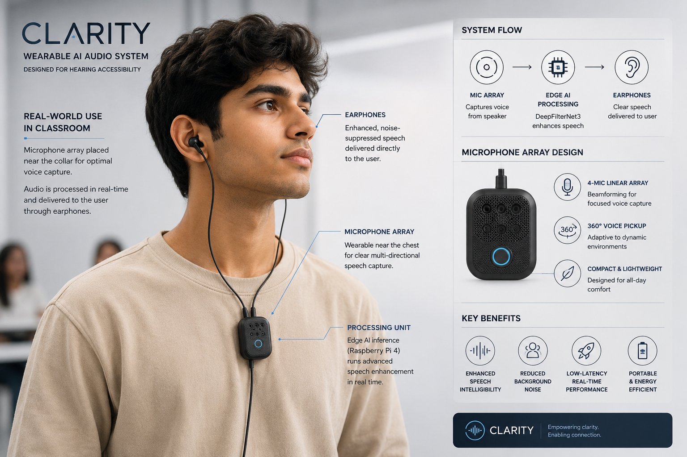

# Product Design

<p align="center">
  
</p>

<p align="center">
  
</p>

## Overview

CLARITY is not merely a speech-enhancement system; it is a user-centric assistive technology platform designed to improve speech intelligibility in noisy environments while preserving natural social interaction.

Traditional assistive listening solutions focus on transmitting a speaker's voice directly to the listener through proprietary broadcasting systems. CLARITY takes a fundamentally different approach. Instead of modifying the environment, the system empowers the user by creating a personalized, intelligent acoustic capture zone around them.

The result is a low-cost, low-latency, and scalable assistive audio solution that can integrate seamlessly with existing hearing aid ecosystems.

---

# Design Philosophy

Most hearing-assistance technologies attempt to solve the problem by introducing additional infrastructure into the environment.

Commercial FM systems require:

* Dedicated teacher microphones
* Specialized RF transmitters
* Proprietary receivers
* Additional maintenance and setup

This introduces logistical complexity, increases cost, and creates dependency on external participants.

CLARITY was designed around a different principle:

> The user should carry the intelligence, not the environment.

By leveraging beamforming, edge-AI, and real-time speech enhancement, the system allows users to independently improve their listening experience without requiring changes to the classroom, workplace, or social environment.

---

# Acoustic Capture & Spatial Agency

## The Challenge

Traditional hearing aids rely primarily on omnidirectional microphones.

These microphones capture sound from all directions equally, resulting in an acoustic mixture containing:

* Speech
* Fan noise
* Classroom chatter
* Reverberation
* Environmental disturbances

As noise levels increase, speech intelligibility decreases significantly.

---

## Dual-Microphone Beamforming

CLARITY addresses this challenge using a dual-MEMS microphone array integrated through the ReSpeaker Lite platform.

Unlike a single microphone, a dual-microphone array can estimate the direction of incoming sound by measuring the Time Difference of Arrival (TDoA) between microphones.

This enables beamforming.

---

## The Beamforming Effect

Beamforming creates a directional listening region that electronically focuses on a target speaker.

Instead of listening equally in all directions, the system prioritizes sounds originating from the direction the user is facing.

This introduces what can be described as:

### Spatial Agency

The user naturally controls the listening focus through body orientation.

If the user turns toward a speaker:

* Speech from that direction is emphasized.
* Competing noise from other directions is suppressed.
* Speech enhancement becomes significantly more effective.

This behavior more closely resembles natural human auditory attention than conventional hearing-aid amplification.

---

# Range & Scalability

The current prototype utilizes the XMOS XU316-powered ReSpeaker Lite platform.

Under typical classroom conditions, the system achieves reliable far-field speech acquisition at distances of approximately:

| Configuration                 | Effective Capture Range |
| ----------------------------- | ----------------------- |
| Current Prototype             | 3–4 meters              |
| Higher-Sensitivity MEMS Array | 5–6 meters              |
| Expanded 4-Microphone Array   | Up to 10 meters         |

The software architecture remains unchanged across these configurations.

Future hardware upgrades can therefore improve capture range without requiring modifications to:

* DeepFilterNet3
* ONNX Runtime
* LADSPA Integration
* Speech Enhancement Pipeline

This modularity enables straightforward deployment in larger classrooms, lecture halls, and conference environments.

---

# Ergonomics & Wearability

A critical design consideration was ensuring that the device integrates naturally into the user's daily life.

The microphone array is intended to be worn near the:

* Upper chest
* Neck
* Lapel
* Collar region

This placement provides several advantages:

* Reduced acoustic obstruction from the user's body
* Improved directional capture
* Higher signal-to-noise ratio
* Comfortable long-term wearability

Because the microphones remain physically separated from the hearing aid itself, the system can be upgraded independently without replacing existing assistive devices.

---

# Latency-Optimized Connectivity

Speech enhancement systems must maintain extremely low latency to avoid disrupting natural conversation.

Even small delays can create perceptual disconnects between:

* Visual lip movement
* Auditory perception
* Cognitive speech processing

To maintain deterministic performance, CLARITY prioritizes wired signal paths between processing components.

### Why Not Bluetooth?

Standard Bluetooth audio introduces:

* Variable transmission delays
* Codec processing overhead
* Synchronization jitter
* Device-dependent latency spikes

These effects can degrade the listening experience, particularly in assistive applications.

### Wired Audio Path

By utilizing a direct wired connection:

* Latency remains predictable
* Audio quality is preserved
* Synchronization is maintained
* System reliability increases

This approach supports the sub-200 ms latency target required for real-time conversational use.

---

# Add-On Manufacturing Strategy

One of the most important design decisions behind CLARITY was avoiding the need to redesign existing hearing aids.

The goal is not to replace medical hearing devices.

The goal is to improve the quality of the audio being delivered to them.

---

## Layered Integration Model

CLARITY functions as an upstream enhancement layer.

```text
Environmental Audio
         │
         ▼
    CLARITY
(Beamforming + AI)
         │
         ▼
 Existing Hearing Aid
         │
         ▼
      User
```

The hearing aid continues to perform:

* Personal amplification
* Frequency equalization
* Audiogram-specific tuning
* Medical-grade calibration

CLARITY simply provides a cleaner and more intelligible input signal.

This dramatically simplifies adoption because existing hearing-aid manufacturing pipelines remain unchanged.

---

# Economic Advantage

The largest barrier to widespread adoption of classroom assistive listening systems is cost.

Commercial FM systems typically require two separate hardware units:

1. A transmitter worn by the speaker.
2. A receiver worn by the listener.

This architecture introduces:

* Additional hardware costs
* RF certification requirements
* Proprietary communication protocols
* Increased maintenance complexity

---

## Single-Unit Architecture

CLARITY eliminates the transmitter entirely.

Instead of transmitting speech directly, the system extracts speech from the surrounding environment using edge-AI.

The entire assistive ecosystem is reduced to a single user-worn device.

Benefits include:

* Lower manufacturing costs
* Simplified deployment
* Increased user independence
* Reduced maintenance
* Elimination of proprietary lock-in

Most importantly, the user retains complete control over their listening experience.

---

# Beyond Hearing Accessibility

Although originally developed for classroom hearing accessibility, the underlying product architecture extends naturally to other domains.

Potential applications include:

* Educational environments
* Workplace accessibility
* Conference systems
* Video conferencing hardware
* Smart communication devices
* Edge-AI wearable audio systems

The core concept remains the same:

> Create an intelligent acoustic capture zone around the user and deliver cleaner speech through real-time AI enhancement.

---

# Key Takeaways

* Beamforming provides directional speech capture and user-controlled listening focus.
* Dual microphones enable spatial awareness through Time Difference of Arrival analysis.
* The current platform supports reliable speech capture at 3–4 meters.
* Future microphone-array upgrades can extend coverage up to 10 meters without changing the software stack.
* CLARITY integrates with existing hearing aids rather than replacing them.
* A single-user device architecture removes the complexity and cost of traditional FM systems.
* The design scales beyond assistive technology into broader real-time speech enhancement applications.
